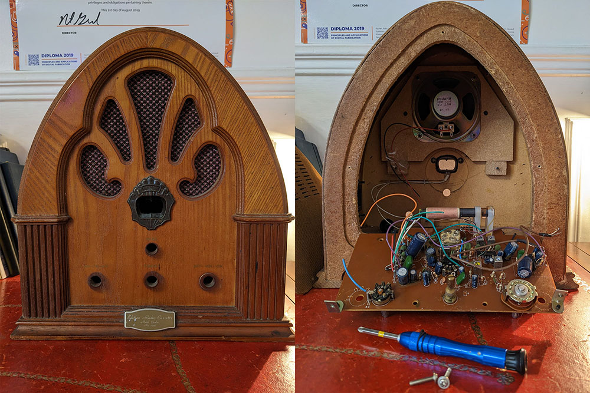

# Modern Vintage Radio

This is my take on the classic wireless vintage radio project. I've wanted to do this for years and I've had this beautiful radio lying around for what seems like ages. So today is the day we finally start this. Well... I say start but as you can see I had already started taking it apart. It's not a truely old radio, it's a replica, but it's old enough to be interesting. It had an audio tape player.

## Objectives

My goal here is to learn how to produce sound with a microcontroller and also how to use Bluetooth. I could have just used a Raspberry Pi and install some kind of media player, but that wouldn't be much fun. Also, every addition to the radio needs to be seamless, like it was meant to be there all along.

So here are the components I want to use:
- [MAX98357 I2S class D mono amp from Adafruit](https://learn.adafruit.com/adafruit-max98357-i2s-class-d-mono-amp/overview)
- ESP32 microcontroller
- OLED display
- SD card reader

I'll also try to re-use some of the original components of the radio, like the potentiometers and 220 to 9V transformer (or not, maybe we'll go full USB-C on this one).

I might also add some extra functionalities like a temperature sensor and RGB LEDs, we'll see how it goes.

The PCB will be milled in the lab but the final version will be manufactured by Aisler. I've wanted to try their services for awhile. The PCB will have to be as modular as possible.

Aesthetically, I want the inside to be as interesting and beautiful as the outside. I'll be replacing the wooden back panel with transparent PMMA to be able to see through it. There'll be LEDs of course. And some brass decorations.

This is a long term project, a labour of love as Neil Gershenfeld would say. So no real time constraints.

## Tasks

- Make a 3D model of the radio in Fusion 360
- Desolder the components I want to salvage
- Figure out how the weird potentiometers work exactly
- Figure out how to produce sound with an ESP32 dev board and the MAX98357
- Read an MP3 from an SD card
- Add Bluetooth functionality
- Design the PCB in KiCAD

- Unmount plastic decoration
- 3D scan decoration
- Mill it in brass
- Re-do the sign in brass

- Redo the knobs
- Print them with SLA printer

## 3D model
